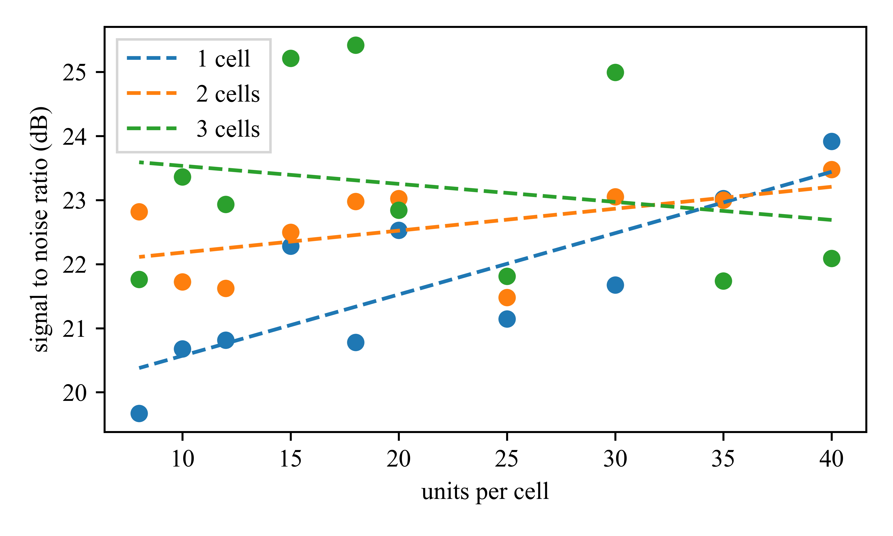
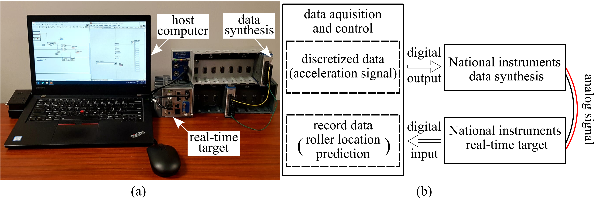

# Towards online structural state estimation with sub-millisecond latency

We present methods of developing and deploying long short-term memory (LSTM) models for use in on-edge devices with sub-millisecond response times.

## Model development

Figure 1. Sampling and computation sequence followed every timestep.

Figure 2. SNR for models with varying units, with one, two, and three cells.

## Hardware

Figure 3. Experimental setup and block diagram representation.

## Results

Figure 4. Prediction from real-time setup.

Figure 5. Distribution of response time for real-time system.

## Licensing and Citation

[![CC BY-SA 4.0][cc-by-sa-shield]][cc-by-sa]

This work is licensed under a
[Creative Commons Attribution-ShareAlike 4.0 International License][cc-by-sa].

[cc-by-sa]: http://creativecommons.org/licenses/by-sa/4.0/
[cc-by-sa-image]: https://licensebuttons.net/l/by-sa/4.0/88x31.png
[cc-by-sa-shield]: https://img.shields.io/badge/License-CC%20BY--SA%204.0-lightgrey.svg
